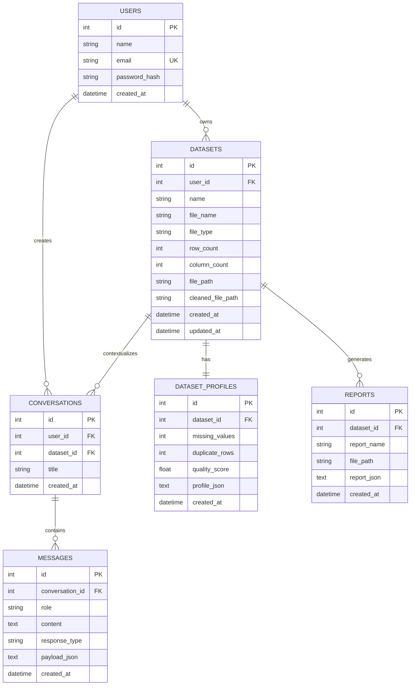

# InsightIQ: System Architecture & Technical Specifications

This document outlines the internal architecture, mathematical formulations, and engineering design principles governing **InsightIQ**.

---

## 1. High-Level Architecture

InsightIQ adheres to a **Decoupled Client-Server Architecture** designed for high throughput, zero hallucination risk, and seamless local or cloud deployment.

```text
┌─────────────────────────────────────────────────────────────┐
│                    Next.js 16+ Frontend                     │
│  - React 19 Client Components & Universal Recharts Renderer │
│  - Tailwind CSS v4 SaaS Design System (Dark/Light Modes)    │
│  - SWR/Fetch REST Client SDK                                │
└──────────────────────────────┬──────────────────────────────┘
                               │ HTTPS / JSON & Multipart
                               ▼
┌─────────────────────────────────────────────────────────────┐
│                     FastAPI Backend Engine                  │
│  - Multi-Format Parser (CSV, XLSX, XLS, JSON)               │
│  - Statistical Profiler & Dynamic Quality Scoring           │
│  - Automated Cleaning & Imputation Pipeline                 │
│  - Controlled NLP Intent Classifier & Query Dispatcher      │
│  - ReportLab PDF Compilation Subsystem                      │
└──────────────┬───────────────────────────────┬──────────────┘
               │                               │
               ▼                               ▼
┌──────────────────────────────┐ ┌────────────────────────────┐
│      Persistence Layer       │ │    Controlled Analytics    │
│  - SQLAlchemy 2.0 ORM        │ │  - Pandas Vectorized Math  │
│  - PostgreSQL 16 (Prod)      │ │  - NumPy & SciPy Engine    │
│  - SQLite (Zero-Config Dev)  │ │  - Scikit-learn Descriptives│
└──────────────────────────────┘ └────────────────────────────┘
```

---

## 2. Controlled Natural Language Execution Engine

A fundamental architectural rule of InsightIQ is: **The dataset is the single source of truth.**
Traditional LLM integration approaches generate raw code or free-text predictions that frequently invent numbers. InsightIQ isolates intent interpretation from arithmetic computation.

### Architectural Flow:
1. **Query Tokenization & Normalization**: User inputs (e.g., *"What is our average revenue?"*) are parsed into normalized lexical tokens.
2. **Fuzzy Entity Resolution**: Query tokens are resolved against actual dataset column headers using Levenshtein distance matching and semantic synonym tables:
   $$\text{Synonyms}(\text{"revenue"}) \rightarrow \{\text{"Sales"}, \text{"Revenue"}, \text{"Amount"}, \text{"Turnover"}\}$$
3. **Intent Classification**:
   - `single_aggregation`: Mean, Sum, Count, Min, Max, Range.
   - `categorical_aggregation`: Groupby dimension with descending sort.
   - `top_n_ranking`: Top-N / Bottom-N slicing.
   - `temporal_trend`: Monthly/Daily resampled time-series aggregation.
   - `correlation_analysis`: Absolute Pearson coefficient ranking.
   - `outlier_audit`: IQR threshold evaluations.
   - `data_quality_audit`: Missingness and duplication summary.
   - `numerical_filtering`: Condition evaluation ($>$, $<$, $=$, above, below).
4. **Deterministic Pandas Execution**: Vectorized operations compute the ground truth:
   $$\mu = \frac{1}{N} \sum_{i=1}^{N} x_i$$
5. **Multi-Modal Payload Packaging**: Responses are formatted into structured UI objects:
   - **KPI Card**: Formatted metric value, label, and contextual delta.
   - **Interactive Chart**: Recharts JSON configuration.
   - **Data Table**: Tabular preview rows with column schemas.
   - **Contextual Explanation**: Business analyst interpretation.

---

## 3. Mathematical Formulations & Data Quality Metrics

### 3.1 Composite Data Quality Score ($Q$)
InsightIQ computes a normalized quality score between $0.0\%$ and $100.0\%$:
$$Q = \max\left(5.0, \min\left(100.0, 100.0 - D_{\text{missing}} - D_{\text{duplicate}} - D_{\text{outlier}}\right)\right)$$

Where:
- **Missingness Penalty**:
  $$D_{\text{missing}} = \min\left(40.0, \frac{\sum \text{Null Cells}}{\text{Total Cells}} \times 150.0\right)$$
- **Duplication Penalty**:
  $$D_{\text{duplicate}} = \min\left(30.0, \frac{\text{Duplicate Rows}}{\text{Total Rows}} \times 150.0\right)$$
- **Outlier Penalty**:
  $$D_{\text{outlier}} = \min\left(15.0, \frac{\text{Total Outliers}}{\text{Total Rows} \times K_{\text{numeric}}} \times 80.0\right)$$

### 3.2 Outlier Detection (Tukey's IQR Fences)
For every numerical series $X$, the 25th percentile ($Q_1$) and 75th percentile ($Q_3$) are computed. The Interquartile Range ($IQR$) is defined as:
$$IQR = Q_3 - Q_1$$
Data points $x \in X$ are classified as statistical outliers if:
$$x < Q_1 - 1.5 \times IQR \quad \lor \quad x > Q_3 + 1.5 \times IQR$$

### 3.3 Pearson Correlation Matrix ($r$)
For numerical column pairs $(X, Y)$:
$$r_{XY} = \frac{\sum_{i=1}^{n} (x_i - \bar{x})(y_i - \bar{y})}{\sqrt{\sum_{i=1}^{n} (x_i - \bar{x})^2} \sqrt{\sum_{i=1}^{n} (y_i - \bar{y})^2}}$$

---

## 4. Database Entity-Relationship Model



---

## 5. Security & Isolation Model

1. **No Code Generation**: LLMs are never permitted to generate Python code for `exec()` or `eval()`.
2. **Safe Imputation**: All data modifications produce new persisted versions, preserving raw source files intact.
3. **MIME & Signature Verification**: Uploads are verified by size ($\le 50\text{MB}$), file extension, and parser byte signatures.
4. **Token Security**: JWT tokens are signed using HMAC-SHA256 (`HS256`) with a configurable secret key.
